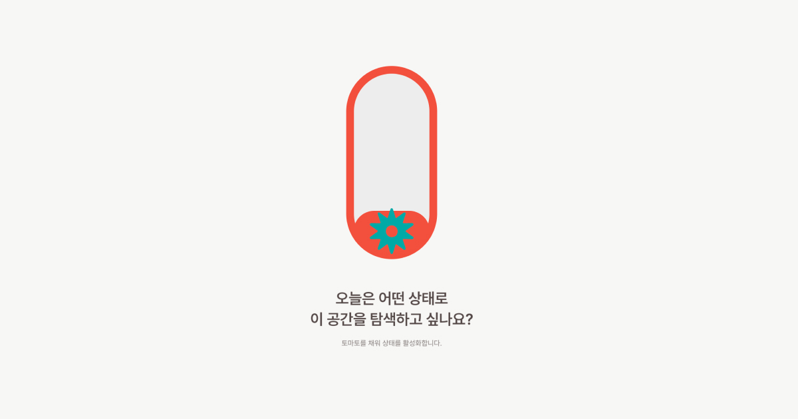
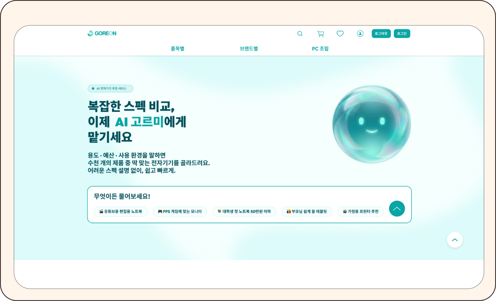
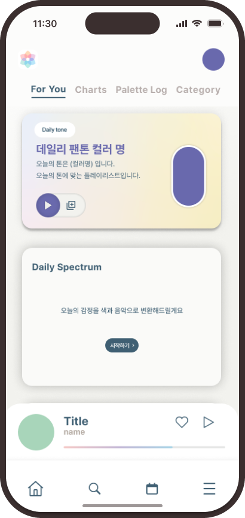
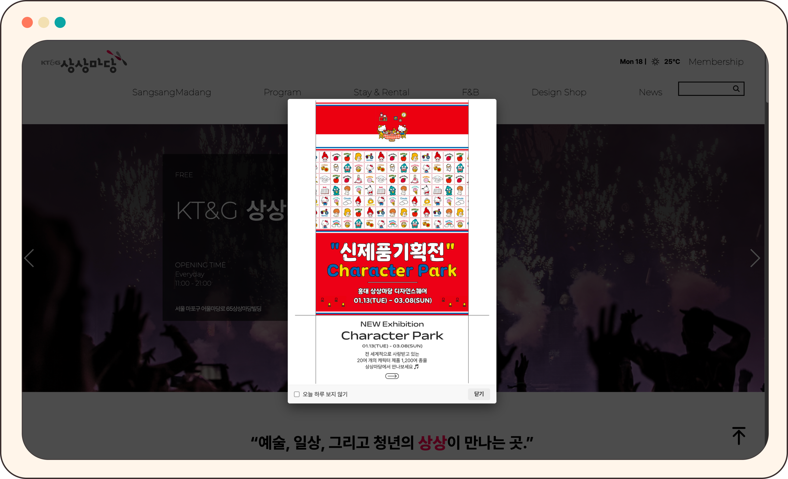

<div align="center">



<br /><br />

# Kwon Sumin — UX Portfolio

**State-driven interface design. Warm editorial UX.**

[](https://gwonsumin.github.io/Resume/)
[](https://react.dev/)
[](https://www.typescriptlang.org/)
[](https://vitejs.dev/)
[](https://sass-lang.com/)

</div>

---

## Overview

사용자의 상태를 이해하고, 그 흐름을 **선택 가능한 경험**으로 구조화하는 포트폴리오 웹사이트입니다.

단순 UI 구현이 아닌, UX 흐름과 인터페이스 구조 설계를 중심으로 만들어졌습니다.

> *"State Interface — 사용자가 어느 상태에 있는지를 감지하고, 그 흐름을 선택의 구조로 전환한다."*

---

## Projects

<table>
  <tr>
    <td width="50%">
      
      <br />
      <h3>🌿 GOREON</h3>
      <p>부동산 정보 비대칭 문제를 해결하는 AI 기반 임장 서비스. 현장 데이터와 AI 분석을 결합해 실수요자 중심의 의사결정 흐름을 설계했습니다.</p>
      <code>UX Research · Service Design · AI Interface</code>
    </td>
    <td width="50%">
      
      <br />
      <h3>🎵 TONE</h3>
      <p>감정과 컨텍스트 기반의 음악 추천 서비스. 사용자의 현재 상태를 감지하고, 그에 맞는 음악 흐름을 큐레이션합니다.</p>
      <code>Emotional UX · Interaction Design · Mobile</code>
    </td>
  </tr>
  <tr>
    <td width="50%">
      
      <br />
      <h3>🏢 상상마당</h3>
      <p>KT&G 상상마당 문화예술 공간 서비스 리디자인. 정보 구조 재설계와 어드민 시스템 UX 개선을 통해 운영 효율과 사용자 경험을 동시에 향상시켰습니다.</p>
      <code>Information Architecture · Admin UX · Redesign</code>
    </td>
    <td width="50%" valign="top">
      <br /><br />
      <h3>📁 Deliverables</h3>
      <ul>
        <li><a href="public/assets/files/GOREON-Proposal.pdf">GOREON Proposal PDF</a></li>
        <li><a href="public/assets/files/TONE-Proposal.pdf">TONE Proposal PDF</a></li>
        <li><a href="public/assets/files/KwonSumin-Resume.pdf">이력서 / Resume PDF</a></li>
      </ul>
    </td>
  </tr>
</table>

---

## Design System

<table>
  <tr>
    <th>Role</th>
    <th>Token</th>
    <th>Value</th>
    <th>Preview</th>
  </tr>
  <tr>
    <td>Main / Accent</td>
    <td><code>--color-main</code></td>
    <td><code>#FF785D</code></td>
    <td></td>
  </tr>
  <tr>
    <td>Point / Teal</td>
    <td><code>--color-point</code></td>
    <td><code>#0AA5A5</code></td>
    <td></td>
  </tr>
  <tr>
    <td>Background</td>
    <td><code>--color-bg</code></td>
    <td><code>#FFF4EB</code></td>
    <td></td>
  </tr>
  <tr>
    <td>Line / Text</td>
    <td><code>--color-line</code></td>
    <td><code>#3B2F2F</code></td>
    <td></td>
  </tr>
</table>

**Typography**
- `Satoshi` — 영문 주력 (Bold · Medium · Regular)
- `Inter` — 영문 보조
- `Pretendard` — 한글

---

## Tech Stack

| Category | Stack |
|---|---|
| Framework | React 19 + TypeScript 6 |
| Build Tool | Vite 8 |
| Styling | SCSS (Module 기반) |
| Routing | React Router v7 |
| Physics | Matter.js (Hero 인터랙션) |
| Deploy | GitHub Pages |

---

## Features

- **Hero 타이포 레이아웃** — editorial 리듬의 대형 타이포그래피 구성
- **커스텀 커서** — Default / Hover 상태 SVG 커서 전환
- **Matter.js 인터랙션** — 물리 기반 오브젝트 반응
- **카드 기반 프로젝트 구조** — clip-path 디테일이 있는 프로젝트 카드
- **Archive 섹션** — 작업 아카이브 그리드
- **Contact Pass** — 패스포트 형식의 연락처 카드 (QR 포함)
- **섹션 스크롤 UX** — 각 섹션 간 자연스러운 흐름 전환

---

## Project Structure

```
Resume/
├── public/
│   ├── projects/          # 프로젝트 스크린샷 & 데모 영상
│   │   ├── goreon/
│   │   ├── tone/
│   │   └── sangsangmadang/
│   ├── assets/files/      # PDF 제안서 & 이력서
│   ├── favicon.svg
│   └── portfolio-og.jpg   # OG 메타 이미지
│
└── src/
    ├── assets/
    │   ├── images/        # heroChr, profile-photo
    │   ├── icons/         # tomato icon variants
    │   ├── shapes/        # SVG 도형 (hero, footer, mask)
    │   ├── cursor/        # 커스텀 커서 SVG
    │   ├── logo/          # 로고 SVG
    │   ├── skills/        # 툴 아이콘 (Figma, Framer, etc.)
    │   ├── archive/       # 아카이브 이미지
    │   ├── contact/       # Contact Pass 에셋
    │   └── fonts/satoshi/ # Satoshi 폰트 (woff2)
    │
    ├── components/        # 재사용 컴포넌트
    └── pages/             # 페이지 단위 구성
```

---

## Getting Started

```bash
# 의존성 설치
npm install

# 개발 서버 실행 (localhost:5173)
npm run dev

# 프로덕션 빌드 + 404 fallback 생성
npm run build
```

---

<div align="center">

Designed & Built by **Kwon Sumin**

[gwonsumin.github.io/Resume](https://gwonsumin.github.io/Resume/) · [Resume PDF](public/assets/files/KwonSumin-Resume.pdf)

</div>
